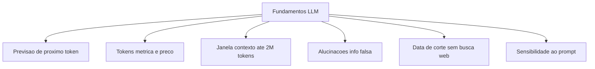
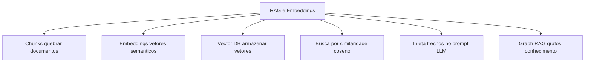
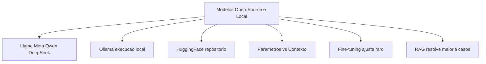
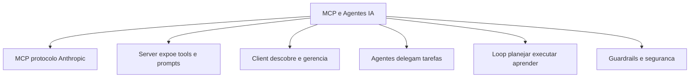
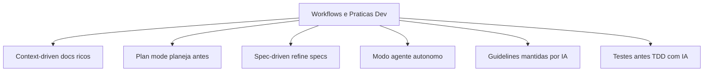
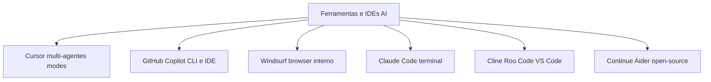

# [Mini Curso] IA para Devs: Dos Fundamentos às Ferramentas e Práticas que Aumentam Produtividade

**Link:** https://www.youtube.com/watch?v=90lGnXnMqgo

## Mind Map
### Cenário Atual: Da Desconfiança à Maturidade [00:00](https://youtu.be/90lGnXnMqgo?t=0)
- A relação dos devs com IA passou por 3 fases: primeiro a desconfiança ("isso não vai funcionar"), depois o medo ("vou perder meu emprego"), e agora a maturidade ("como usar isso pra ser mais produtivo?")
- Quem lidera times precisa entender os fundamentos pra tomar decisões reais: qual modelo usar, quanto vai custar, é seguro, é rápido o suficiente?
- Saber quando NÃO usar uma LLM é tão importante quanto saber usar — às vezes um algoritmo simples resolve melhor que um modelo de 70 bilhões de parâmetros

### Como LLMs Funcionam: O Grande Autocomplete [08:00](https://youtu.be/90lGnXnMqgo?t=480)
- Imagina o autocomplete do seu celular quando você digita "bom...". Ele sugere "dia", "tarde", "noite" baseado no que você já escreveu antes. Uma LLM faz exatamente isso — só que com muito mais contexto e precisão
- A diferença é que ela não está escolhendo entre 3 opções, mas entre milhões, calculando qual a próxima palavra mais provável dado tudo que veio antes
- Modelos multimodais são os que entendem não só texto, mas também imagem, áudio e vídeo — como se o autocomplete agora também "visse" uma foto e soubesse completar a descrição dela

### Tokens e Janela de Contexto [10:00](https://youtu.be/90lGnXnMqgo?t=600)
- Token é como se fosse a "moeda" da IA — cada palavra ou pedaço de palavra que o modelo processa custa tokens. "Inteligência artificial" pode ser 2 tokens
- Janela de contexto é tipo a memória de curto prazo do modelo — quanta informação ele consegue "lembrar" de uma vez enquanto está te respondendo. O GPT-2 de 2019 lembrava o equivalente a uma página; o Gemini 1.5 Pro de 2024 lembra o equivalente a 3 livros inteiros
- Porém, tem uma pegadinha: se você lotar quase toda essa memória, o modelo começa a "esquecer" coisas no meio — tipo você tentar lembrar de uma lista de compras de 200 itens, alguma coisa vai escapar

### Principais Limitações das LLMs [12:00](https://youtu.be/90lGnXnMqgo?t=720)
- Alucinações: é quando a IA inventa uma resposta com toda confiança do mundo, mas ela é falsa. Exemplo clássico: pedir pra listar artigos científicos de um autor e ela criar títulos que nunca existiram
- Data de corte: a IA é como uma enciclopédia impressa em 2023 — ela não sabe nada que aconteceu depois disso, a menos que você dê acesso à internet
- Sensibilidade ao prompt: mudar uma palavra na sua pergunta pode gerar uma resposta completamente diferente. "Explique RAG" vs "Explique RAG para uma criança de 10 anos" — resultados totalmente distintos
- Contexto muito cheio: quanto mais informação você joga de uma vez, mais a IA se perde — igual uma pessoa tentando prestar atenção em 10 conversas ao mesmo tempo

### Modelos Pré-Treinados e Fine-Tuning [15:00](https://youtu.be/90lGnXnMqgo?t=900)
- Pensa nos modelos GPT, Gemini, Claude como chefs que já fizeram curso de culinária completo (pré-treinamento). Eles sabem cozinhar quase tudo. Você não precisa ensinar do zero
- Fine-tuning é como mandar esse chef fazer um curso específico de sushi — ele já sabe cozinhar, mas você quer que ele fique excepcional num nicho. É caro e trabalhoso
- Na prática, pra 95% dos casos, você não precisa de fine-tuning. A técnica de RAG resolve o problema — é como dar ao chef uma ficha com os ingredientes e o modo de preparo do seu restaurante, sem precisar mandar ele fazer outro curso

### Modelos Open-Source e Execução Local [17:00](https://youtu.be/90lGnXnMqgo?t=1020)
- Modelos open-source (Llama da Meta, Qwen, DeepSeek, Mistral) são como receitas de bolo publicadas gratuitamente — você pode usar, modificar e até cozinhar na sua própria cozinha
- Ollama é o "eletrodoméstico" que torna isso fácil — você instala, escolhe o modelo e roda na sua máquina, sem depender de internet ou pagar por API
- Hugging Face é tipo um GitHub de modelos de IA — tem milhares de modelos prontos, datasets pra treinar e versões modificadas pela comunidade
- Parâmetros são como os "neurônios" da rede — mais parâmetros geralmente significa mais capacidade, mas nem sempre significa melhor. Tem pesquisa mostrando que às vezes remover parâmetros deixa o modelo mais inteligente — tipo tirar "sujeira" do cérebro

### RAG — A Técnica que Resolve a Maioria dos Problemas [23:00](https://youtu.be/90lGnXnMqgo?t=1380)
- RAG é tipo dar uma "cola" pra IA durante a prova. Em vez de confiar só na memória dela (que pode falhar), você entrega os trechos relevantes do seu material de estudo
- Como funciona na prática: imagine que você tem um manual de 500 páginas. Você não joga ele inteiro pra IA. Você quebra em pedacinhos, transforma cada pedaço em coordenadas numéricas (embeddings), e quando pergunta algo, o sistema acha os 3 parágrafos mais relevantes e manda SÓ eles junto com sua pergunta
- Graph RAG é uma versão mais sofisticada — em vez de buscar por similaridade de texto, você monta um mapa de conexões (quem conhece quem, o que depende do quê) e navega por ele. É como usar o Google Maps em vez de adivinhar o caminho

### Embeddings: Como a IA "Entende" Palavras [32:00](https://youtu.be/90lGnXnMqgo?t=1920)
- Embeddings transformam palavras em listas de números — tipo coordenadas GPS. "Cachorro" e "gato" ficam em coordenadas próximas (são animais de estimação), enquanto "cachorro" e "carro" ficam bem distantes
- Exemplo visual: num mapa 2D, "rei" e "rainha" estariam próximos; "homem" e "mulher" também próximos, mas em outra região. Palavras com significado parecido = coordenadas parecidas
- Essa é a tecnologia por trás de tudo que envolve busca inteligente, recomendação e o próprio RAG — sem embeddings, a IA não saberia que "automóvel" e "carro" são a mesma coisa

### MCP — O Padrão que Conecta IA com Ferramentas [34:00](https://youtu.be/90lGnXnMqgo?t=2040)
- Antes do MCP, conectar uma IA no seu banco de dados, no seu e-mail e no seu calendário era um pesadelo — cada ferramenta precisava de um código customizado diferente pra cada modelo de IA
- MCP (Model Context Protocol, criado pela Anthropic) é tipo uma "tomada universal" — qualquer ferramenta que segue o padrão MCP conecta em qualquer IA que também segue
- Na prática: um MCP Server expõe o que sabe fazer ("sei buscar e-mails", "sei criar eventos"); um MCP Client descobre essas capacidades e gerencia as chamadas que a IA faz. É plug-and-play

### Agentes de IA: Quando a IA Toma Decisões Sozinha [36:00](https://youtu.be/90lGnXnMqgo?t=2160)
- A diferença entre um chat normal e um agente: no chat você pergunta "qual a previsão do tempo?", a IA responde e acabou. Um agente recebe "me avisa se chover amanhã e remarca minhas reuniões externas" — ele planeja, executa e verifica
- Componentes de um agente: o cérebro (a LLM), as mãos (ferramentas via MCP), a memória (contexto da conversa + banco de dados externo), e regras de segurança (guardrails — tipo "nunca delete nada sem confirmar")
- Em IDEs modernas, o "modo agente" significa que a IA pode ler seu código, planejar mudanças, editar arquivos, rodar testes e iterar até funcionar — tudo numa tacada só

### Workflows e Desenvolvimento Assistido: Como Trabalhar com IA no Dia a Dia [41:00](https://youtu.be/90lGnXnMqgo?t=2460)
- Context-driven: pense na IA como um novo dev que chegou no time. Se você tem documentação boa, guidelines e código organizado, ela produz muito. Se o projeto é uma bagunça, ela vai produzir código bagunçado também
- Plan mode: antes de sair codando, você pede pra IA planejar tudo — quais arquivos mexer, quais funções criar, como testar. É tipo fazer a planta da casa antes de levantar as paredes
- Spec-driven development: você escreve em linguagem natural O QUE quer (a especificação) e deixa a IA decidir COMO fazer (a implementação). Testes viram especificações executáveis — se passar no teste, tá certo
- Dica prática do Waldemar: a cada feature nova, peça pra IA atualizar as guidelines do projeto. Assim sua documentação cresce organicamente e fica cada vez mais útil

### Ferramentas: O Que Usar e Quando [66:00](https://youtu.be/90lGnXnMqgo?t=3960)
- Cursor: a ferramenta mais completa — tem multi-agentes (vários "especialistas" trabalhando juntos), plan mode, integração com Jira, e você pode criar agentes customizados (ex: um só pra revisar arquitetura)
- GitHub Copilot: o "irmão mais velho" — funciona em qualquer IDE e tem CLI, mas é menos autônomo que o Cursor. Ideal pra quem já tá no ecossistema GitHub
- Windsurf: diferencial é o browser interno — se você mexe com frontend, consegue ver as mudanças em tempo real sem sair do editor
- Claude Code: via terminal, usa os modelos Claude que são excelentes pra código. É minimalista mas muito poderoso
- Open-source: Cline e Roo Code são extensões gratuitas pro VS Code com suporte a MCP; Continue e Aider focam em planejamento e execução autônoma — ideais pra quem não quer pagar assinatura

## Interesting Topics
- A transição do "vibe coding" (codar no feeling, sem planejar) pro "spec-driven development" (especificar antes, codar depois) — a IA tá nos forçando a ser mais disciplinados
- O modelo mental do "grande autocomplete" — simples mas explica tudo: a IA não "pensa", ela completa padrões. Isso muda como você escreve prompts
- A descoberta com algoritmo genético: remover parâmetros pode melhorar o modelo — às vezes menos é mais. Contraintuitivo pra quem acha que "maior = melhor"
- Documentação deixou de ser burocracia chata e virou combustível: quanto melhor documentado seu projeto, mais rápido e preciso o agente trabalha
- Criar agentes especializados (um pra arquitetura, um pra testes, um pra segurança) como padrão de trabalho — em vez de um agente faz-tudo medíocre

## Tools & Technologies
- `Ollama` — roda modelos open-source (Llama, Qwen, DeepSeek) na sua máquina, sem internet
- `Hugging Face` — o GitHub dos modelos de IA: modelos, datasets, fine-tunings da comunidade
- `MCP (Model Context Protocol)` — padrão da Anthropic para conectar IA com ferramentas externas (tomada universal)
- `RAG` — técnica de busca semântica + injeção de contexto que resolve 95% dos casos sem retreinar modelo
- `Graph RAG` — RAG turbinado com grafos de conhecimento (usa Neo4j + linguagem Cypher)
- `Cursor` — IDE mais completo pra IA: multi-agentes, plan mode, integração Jira, agents customizados
- `GitHub Copilot` — assistente de código com CLI, boa integração nativa com GitHub
- `Windsurf` — IDE com browser interno embutido, ideal pra dev frontend
- `Claude Code` — assistente minimalista via terminal usando modelos Claude
- `Cline / Roo Code` — extensões gratuitas VS Code com suporte a MCP e múltiplos provedores
- `Continue / Aider` — open-source com foco em planejamento e execução autônoma
- `RAGAS` — biblioteca pra medir a qualidade do seu pipeline RAG (métricas de precisão e relevância)

## Resumo Geral
> Este mini-curso é um mapa completo pra devs experientes navegarem na era da IA sem se perder no hype. A tese central: você não precisa virar PhD em machine learning — mas entender o básico (tokens são a moeda, contexto é a memória, embeddings são coordenadas, RAG é a "cola", MCP é a tomada universal, agentes tomam decisões) te dá autonomia real pra escolher ferramentas, controlar custos e montar um workflow que multiplica sua produtividade em vez de só gerar código duvidoso. A segunda metade é prática pura: como usar Cursor, Copilot e Claude Code com mentalidade "spec-driven" — você vira o arquiteto que especifica o que quer, e a IA vira o pedreiro que executa. O segredo? Documentação viva, atualizada a cada feature. O futuro não é a IA substituir devs — é devs que dominam a orquestração de IA substituindo devs que não dominam.

## Mind Map (Mermaid)

### Fundamentos LLM

&nbsp;

### RAG e Embeddings

&nbsp;

### Modelos Open-Source e Execucao Local

&nbsp;

### MCP e Agentes IA

&nbsp;

### Workflows e Praticas de Desenvolvimento

&nbsp;

### Ferramentas e IDEs com IA

