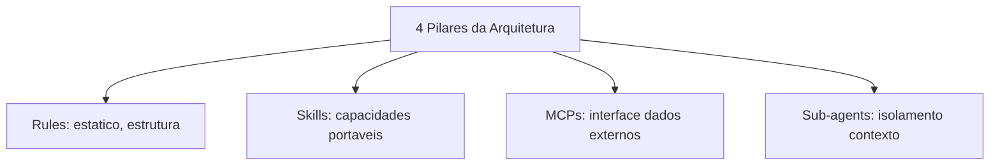
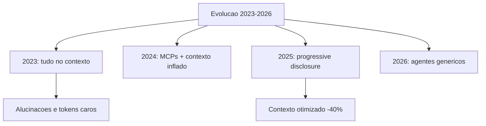
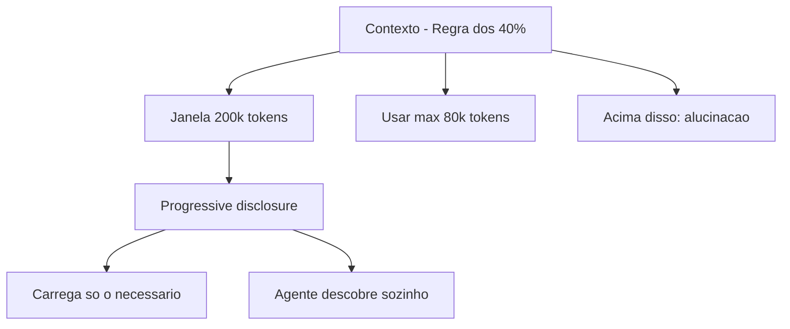
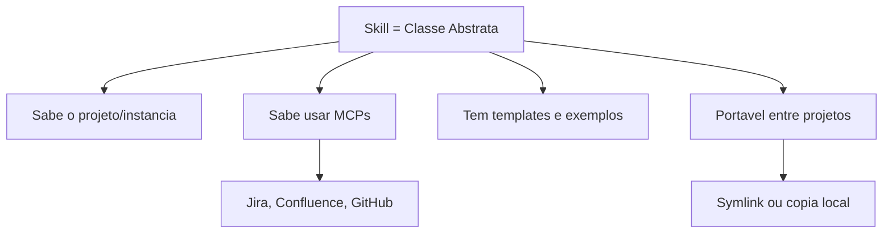
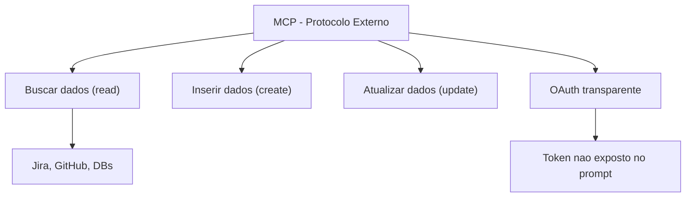
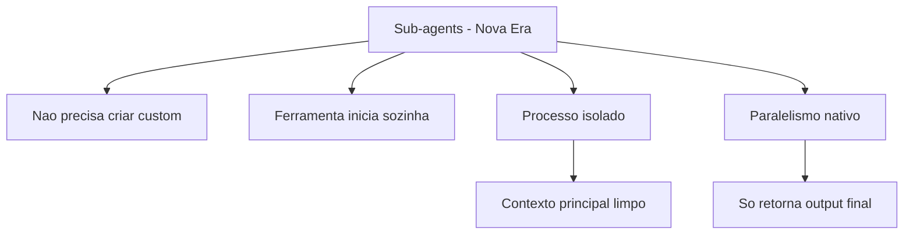
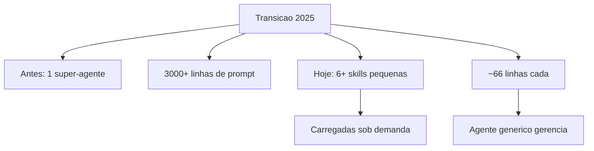

# Rules, Skills, MCPs and Subagents - Domine os Conceitos-Chave de IA para Produtividade

**Link:** https://www.youtube.com/watch?v=omkEi4GTCj8

## Mind Map
### Fluxo Real: Do Bug ao Plano de Correcao [00:00](https://youtu.be/omkEi4GTCj8?t=0)
- Demonstracao ao vivo de um fluxo de trabalho com IA em 2025
- Tudo comeca com um bug real no Jira: "JWT token invalido quando usuario faz login com e-mail"
- O desenvolvedor so diz "crie um plano para corrigir o bug" — e a IA resolve
- Por tras dos panos: uma skill busca a task no Jira usando o MCP da Atlas
- Enquanto isso, varios sub-agents vasculham o codigo em paralelo
- Resultado: um plano de implementacao completo, com contexto principal em apenas 25%
- Antigamente (3 meses atras) isso exigia muito mais trabalho manual

### O Problema do Contexto - Analogia da Mesa de Trabalho [04:00](https://youtu.be/omkEi4GTCj8?t=240)
- Imagine sua mesa de trabalho. Se voce espalhar 50 documentos ao mesmo tempo, vai se perder
- Com IA e igual: jogar tudo no contexto faz ela "alucinar" (inventar respostas erradas)
- 2023-2024: as pessoas colocavam documentacao, regras, MCPs, workflows — TUDO de uma vez
- Resultado: contexto gigante, tokens carissimos, respostas sem sentido
- Regra de ouro descoberta em 2025: use no maximo 40% da janela de contexto
- Exemplo pratico: se o modelo suporta 200 mil tokens, mantenha abaixo de 80 mil
- Acima disso e como tentar ler 10 livros ao mesmo tempo — voce nao entende nenhum direito
- Solucao: "progressive disclosure" — carregar so o necessario, na hora que precisa

### Arquitetura Atual - Os 4 Pilares (Visao Geral) [09:00](https://youtu.be/omkEi4GTCj8?t=540)
- Pense numa casa: rules sao a planta baixa, skills sao os comodos funcionais, MCPs sao as portas para o mundo externo, sub-agents sao os trabalhadores que fazem coisas em paralelo
- Rules / Agents.md → conhecimento fixo: "isso aqui e o projeto, essa e a arquitetura"
- Skills → capacidades reutilizaveis: "eu sei criar testes, buscar tasks, analisar modulos"
- MCPs → pontes para sistemas externos: Jira, GitHub, bancos de dados, Confluence
- Sub-agents → trabalhadores isolados que fazem tarefas pesadas sem baguncar sua mesa

### Rules e Agents.md - A Planta Baixa do Projeto [10:30](https://youtu.be/omkEi4GTCj8?t=630)
- Rules sao como o manual de convivencia do projeto: estilo de codigo, convencoes, estrutura
- Agents.md e o padrao da industria — um arquivo na raiz do projeto que toda IA le ao iniciar
- Regra fundamental: no maximo 200 linhas! So a estrutura basica + indicacoes de onde achar mais detalhes
- Exemplo real de uma rule de arquitetura:
  - "Este projeto tem 3 dominios modulares. Estrutura em /src/domain1, /src/domain2..."
  - "Se precisar de detalhes de arquitetura, veja architecture-overview.md"
  - "Se precisar de padroes de banco de dados, veja database-entities.md"
- Dica pratica: se seu projeto e legado, peca para a IA analisar e GERAR o agents.md para voce
- No Claude Code isso ja e nativo (comando onboard); no Cursor voce configura como rule
- Pode carregar sempre (always-apply) ou sob demanda (on-demand)

### Como Era Antes - A Era dos Super-Agentes [14:00](https://youtu.be/omkEi4GTCj8?t=840)
- Ate meados de 2025, a estrategia era criar "super-agentes" customizados
- Exemplo real mostrado na live: um agente com 3000+ linhas de instrucoes
- Ele sabia TUDO: criar componentes React, validar formularios, integrar APIs, escrever testes...
- Problema 1: cada conversa nova ja comia metade do contexto so para carregar o agente
- Problema 2: se voce usava o plano mais barato do Claude, dizia "oi" e ja gastava o limite
- Problema 3: era praticamente uma equipe inteira virtual — frontend, backend, QA, tudo num so
- Sub-agents eram usados para duas coisas ao mesmo tempo: (1) ser um processo isolado E (2) ter uma habilidade especializada. Isso criava confusao

### Skills - Capacidades Portateis (a Grande Virada) [21:00](https://youtu.be/omkEi4GTCj8?t=1260)
- Skill e como uma ferramenta de jardim: voce nao precisa de uma maquina inteira, so da pa
- Analogia de programador: skill esta para MCP assim como uma classe esta para uma API
  - Sem a classe: voce escreve toda a requisicao HTTP, token, headers... toda vez
  - Com a classe: voce so chama `jiraClient.getTask("CAN-123")` — a instrumentacao fica encapsulada
- Exemplo real da skill Jira Assistant:
  - Ela ja sabe qual e o projeto (CAN), o cloud ID, a instancia da Atlas
  - O dev so diz "corrige o bug" — a skill resolve o resto
  - Sem a skill: "corrige o bug na URL techleads.atlassian.net, cloud digital, board CAN..."
- Skills sao PORTATEIS: voce cria uma vez e usa no Cursor, Claude Code, Copilot, em qualquer projeto
- O agente descobre e carrega skills automaticamente — voce nao precisa dizer "use a skill X"
- Front matter da skill tem so ~66 linhas com descricao e triggers (quando usar)
- Pode mandar para colegas de time como se fosse um arquivo — "toma, usa essa skill de testes e2e"

### MCPs - As Pontes para o Mundo Externo [24:00](https://youtu.be/omkEi4GTCj8?t=1440)
- MCP (Model Context Protocol) e como um adaptador universal — tipo um canivete suico de APIs
- Criado pela Anthropic (empresa do Claude), hoje e padrao da industria — todo mundo usa
- Para que serve: buscar, inserir e atualizar dados em sistemas externos
- Vantagem sobre fazer um "fetch" direto na API:
  - MCP gerencia autenticacao (OAuth) de forma transparente — seu token nao aparece no prompt
  - Suporta REST, GraphQL, gRPC — um protocolo unico resolve tudo
  - Zero esforco apos configurar: o agente ja sabe achar e usar automaticamente
- Exemplo pratico: com MCP do GitHub + MCP do Jira, voce pode:
  - "Cria o PR" → MCP do GitHub cria
  - "Adiciona comentario na task dizendo que o PR foi criado" → MCP do Jira atualiza
  - "Documenta no Confluence o que foi feito na sprint" → MCP do Confluence publica
- Quando usar MCP vs Skill:
  - Dados que MUDAM com frequencia (paginas do Confluence, status de tasks) → MCP
  - Conhecimento ESTAVEL (como criar um teste, template de task) → Skill
  - Se sua empresa tem 100 MCPs carregados, fica lento — skills sao melhores nesse caso

### Skills vs MCPs vs Sub-agents - O Raio-X Definitivo [27:00](https://youtu.be/omkEi4GTCj8?t=1620)
- Agents.md / Rules: "O QUE e esse projeto" — conhecimento estatico, sempre carregado
- Skills: "COMO fazer X" — capacidade portavel, carregada sob demanda
- MCPs: "ONDE buscar/alterar dado externo" — interface com o mundo
- Sub-agents: "FACA isso em paralelo sem poluir meu contexto" — isolamento de processo
- Diferenca crucial entre Skill e Sub-agent:
  - Skill NAO reduz o contexto — ela roda no mesmo processo, so adiciona conhecimento
  - Sub-agent SIM reduz — e um processo separado que so devolve o resultado final
- Analogia: Skill e um manual de instrucoes na sua mesa. Sub-agent e um assistente que vai para outra sala, pesquisa, e volta so com a resposta

### Sub-agents Genericos - A Revolucao Silenciosa [33:00](https://youtu.be/omkEi4GTCj8?t=1980)
- A grande novidade de 2025: voce NAO precisa mais criar sub-agents customizados
- As ferramentas (Cursor, Claude Code) agora tem agentes GENERICOS inteligentes
- Como funciona: voce diz "analisa os 3 modulos em paralelo"
  - A ferramenta automaticamente inicia 3 processos isolados
  - Cada um recebe so o contexto necessario
  - Cada um pode usar skills disponiveis
  - So o resultado final volta para o contexto principal
- Exemplo real da live: "analyze the three domain modules in parallel"
  - O agente generico disparou analises paralelas
  - Buscou arquivos, carregou skills relevantes (evaluate domain module, modularity assessment)
  - Contexto principal permaneceu limpo e baixo
- Isso resolve o problema historico: antes, sub-agents eram usados tanto para isolamento quanto para habilidades. Agora: skills = habilidade, sub-agents = isolamento. Cada um na sua.

### Checklist Pratico - Resumo para Aplicar Hoje [36:00](https://youtu.be/omkEi4GTCj8?t=2160)
- Agents.md / Rules (estatico, sempre ou sob demanda):
  - Estrutura de alto nivel do projeto
  - Convencoes de codigo (ex: "nunca use 'any' no TypeScript")
  - Ponteiros: "se precisar de arquitetura, veja X; se precisar de banco, veja Y"
- Skills (capacidades portaveis):
  - Criar teste end-to-end, buscar task do Jira, gerar release, analisar modulo
  - Cada skill e independente, portavel, compartilhavel entre times
  - Front matter curto (~66 linhas) com description clara dos triggers
- MCPs (dados externos):
  - APIs da empresa (Jira, GitHub, bancos), sistemas corporativos
  - Lento mas padronizado — unico protocolo para tudo
- Sub-agents (processos isolados):
  - Nao crie customizados — as ferramentas gerenciam automaticamente
  - Foque em criar boas skills que os agentes genericos vao usar

### Fim dos Custom Agents - O Que Mudou [40:00](https://youtu.be/omkEi4GTCj8?t=2400)
- Exemplo real de transformacao: um super-agente de 3000+ linhas foi desmembrado
- Virou 6+ skills independentes: formularios, APIs, componentes, testes, configuracao...
- Cada skill tem ~66 linhas de front matter — carregada so quando necessaria
- Antes: "vou chamar o agente de formularios" (carregava 3000 linhas de uma vez)
- Agora: "preciso validar esse campo" → o agente generico detecta e carrega so a skill de validacao
- A industria entendeu: sub-agents sao para ISOLAMENTO de processo, nao para CAPACIDADE
- Skills assumiram o papel de capacidade. Sub-agents ficaram com o papel de execucao isolada.

### Biblioteca de Skills do Tech Leads Club [44:00](https://youtu.be/omkEi4GTCj8?t=2640)
- Iniciativa open source: biblioteca de skills curadas pela comunidade
- Diferencial: skills seguem boas praticas (maximo 500 linhas, triggers claros)
- Mercado atual tem skills de 2000-3000 linhas — vai contra as recomendacoes da Anthropic
- Instalador inteligente: detecta quais IDEs voce tem, pergunta se quer symlink ou copia
- Symlink = atualizacoes automaticas quando a biblioteca atualizar
- Skill de exemplo: spec-driven development (inspirada no spec-kit do GitHub)
  - Conversa interativa: pergunta sobre criterios de aceite, design, MCPs a usar
  - Conduz o desenvolvedor num bate-papo estruturado ate ter uma spec completa
- repositorio aberto para contribuicoes — comunidade pode propor e revisar skills

## Interesting Topics
- Progressive disclosure: a IA carrega so o que precisa, quando precisa — como um garcom que so traz o prato que voce pediu, nao o cardapio inteiro
- Analogia do contexto como mesa de trabalho: mesa limpa = pensamento claro; mesa entulhada = confusao
- Skills mudam o jogo do trabalho em equipe com IA: em vez de cada dev reinventar a roda, compartilham skills como quem compartilha atalhos de teclado
- O ciclo de maturidade: primeiro jogavam tudo no prompt → depois criaram super-agentes → agora tem skills modulares
- Empresas estao criando "marketplaces internos de skills" — conhecimento institucional empacotado e reutilizavel
- Spec-driven development: planejar ANTES de codar, usando skills que guiam a conversa de design

## Tools & Technologies
- `Cursor` — IDE pioneira em rules, agora suporta skills e MCPs
- `Claude Code` — CLI da Anthropic com comando onboard que gera agents.md automaticamente
- `GitHub Copilot` — suporta agents.md, skills e MCPs (padroes da industria)
- `MCP (Model Context Protocol)` — protocolo criado pela Anthropic para conectar IAs a sistemas externos
- `Atlas MCP` — implementacao MCP para Jira (buscar, criar, atualizar, comentar tasks)
- `Tech Leads Club Skills Library` — biblioteca open source de skills curadas pela comunidade
- `spec-kit (GitHub)` — ferramenta de spec-driven development que inspirou skills da biblioteca

## Resumo Geral
> Este video e um mapa completo de como desenvolver com IA em 2025 sem desperdicar tokens nem sofrer com alucinacoes. O segredo esta em 3 camadas: (1) agents.md define o terreno — a arquitetura e as regras do projeto, como a planta de uma casa; (2) skills sao as ferramentas — capacidades portateis que voce cria uma vez e reutiliza em qualquer projeto, como uma caixa de ferramentas bem organizada; (3) MCPs sao as pontes para o mundo externo — Jira, GitHub, bancos de dados, tudo acessivel por um unico protocolo. Sub-agents genericos fazem o trabalho pesado em segundo plano sem baguncar sua mesa. A grande licao pratica: pare de criar agentes customizados enormes. Crie skills pequenas e focadas (max 500 linhas), deixe as ferramentas gerenciarem os agentes, e mantenha seu contexto de trabalho sempre abaixo de 40% da capacidade. E como cozinhar com mise en place: cada ingrediente no seu potinho, so entra na panela na hora certa.

## Mind Map (Mermaid)

### Os 4 Pilares

&nbsp;

### Evolucao do Contexto

&nbsp;

### Regra de Ouro do Contexto

&nbsp;

### Skill na Pratica

&nbsp;

### MCP na Pratica

&nbsp;

### Sub-agents Genericos

&nbsp;

### De Custom Agents para Skills

